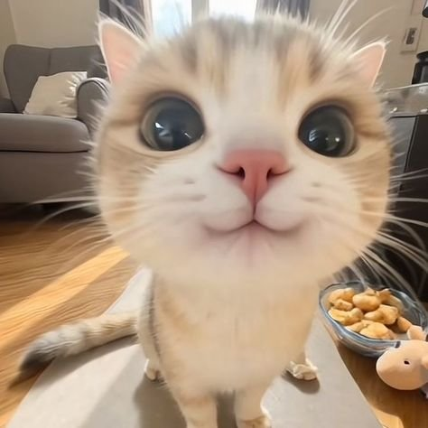
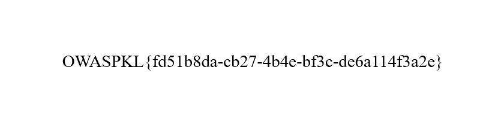
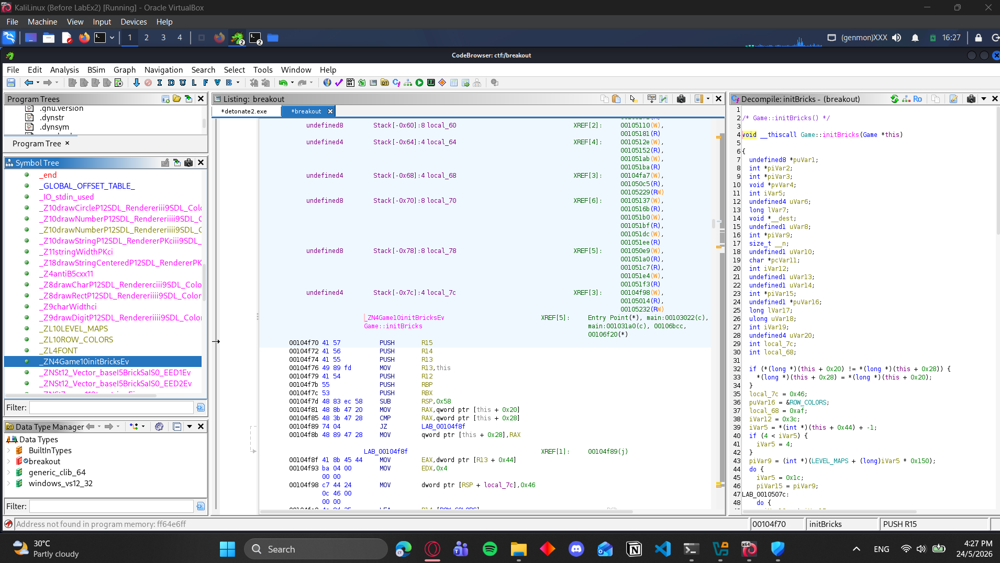

# Atari_Breakout

## Overview

This challenge looked like a simple breakout clone at first, but the binary was hiding something more interesting inside its embedded assets. The useful path was not to brute-force the gameplay, but to inspect how the program loaded its internal resources.

Using Ghidra, I traced the decompiled `main` logic and found that the game was loading two blobs directly from memory with `SDL_RWFromMem` and `IMG_Load_RW`. That was the key clue: the flag was not in the obvious text strings, it was inside one of the packed image assets.

## Static Analysis

The decompiler showed two embedded buffers being turned into textures:

```c
IMG_Init(2);
lVar11 = SDL_RWFromMem(GQ3mHqOK6n, GQ3mHqOK6nl);
if ((lVar11 != 0) && (lVar11 = IMG_Load_RW(lVar11,1), lVar11 != 0)) {
	local_118 = SDL_CreateTextureFromSurface(local_250,lVar11);
	SDL_FreeSurface(lVar11);
}
lVar11 = SDL_RWFromMem(US0JFpkLGR, US0JFpkLGRl);
if ((lVar11 != 0) && (lVar11 = IMG_Load_RW(lVar11,1), lVar11 != 0)) {
	local_110 = SDL_CreateTextureFromSurface(local_250,lVar11);
	SDL_FreeSurface(lVar11);
}
```

That matched the raw headers I saw in the binary dump. One asset was a JPEG and the other was a PNG, so the next step was to dump them out of memory and inspect them directly.

## Extracting the Assets

The cleanest way to recover the files was to use GDB and dump the embedded memory ranges straight to disk:

```bash
gdb ./breakout
```

Inside GDB, I used:

```gdb
dump memory asset_jpeg.jpg (char*)&GQ3mHqOK6n ((char*)&GQ3mHqOK6n + 31911)
dump memory asset_png.png (char*)&US0JFpkLGR ((char*)&US0JFpkLGR + 7197)
```

After opening the extracted images, one of them was just a cat picture, and the other contained the actual flag.

## Flag

`OWASPKL{fd51b8da-cb27-4b4e-bf3c-de6a114f3a2e}`

## Takeaway

The important lesson here was to stop treating the game like a normal gameplay challenge. Once I followed the asset-loading path in Ghidra, the hidden resources were easy to dump and inspect.

## Extracted Images

The two assets embedded in the binary were extracted and saved in the `images/` folder. Both are included below.





### Findings screenshots


(images/findingss.png)
(images/findings.png)
